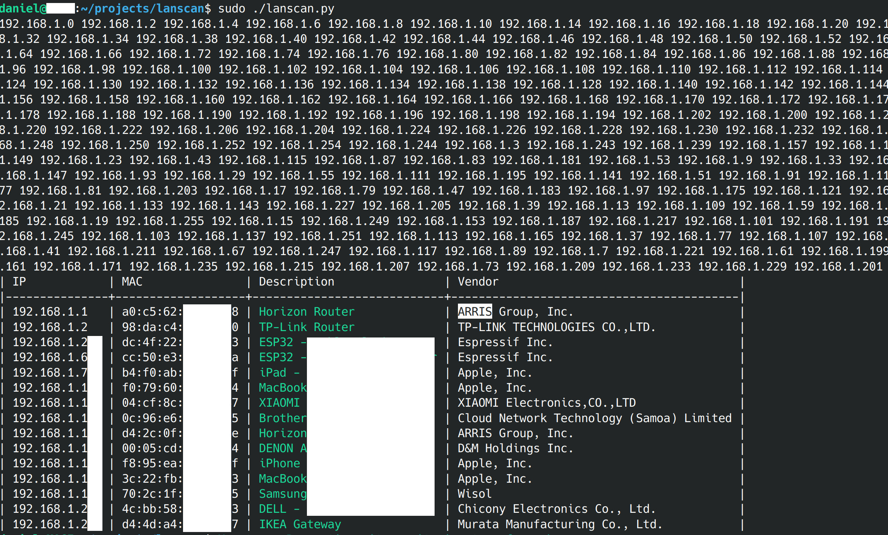

# lanscan 
Simple scanner of LAN devices using ARP requests that can detect known devices based on simple CSV file. Usable for regular home or small office network scanning in search for unknown devices.

Uses parallel unicast ARP requests beacuse some devices, especially phones on WiFi will ignore multicast ARP floods.

## Installing 
```
sudo pip3 install -r requirements.txt
```

## Running

**Requires sudo** as ARP requests use raw network sockets.

### Config file - `config.csv`

Format is quite simple:
```
subnet,<YOUR_NETWORK_CIDR>
<MAC_ADDR_OF_DEV_1>,<FRIENDLY_NAME_OF_DEV_1>
<MAC_ADDR_OF_DEV_2>,<FRIENDLY_NAME_OF_DEV_2>
<MAC_ADDR_OF_DEV_3>,<FRIENDLY_NAME_OF_DEV_3>
...
```

### Example execution


